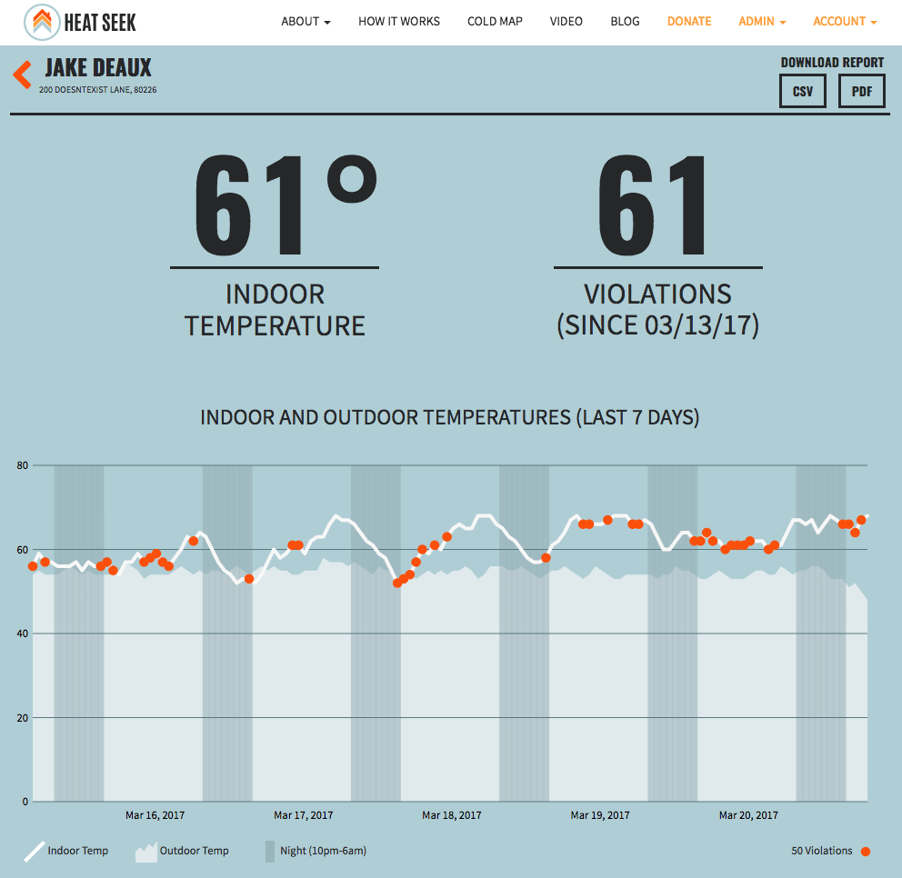
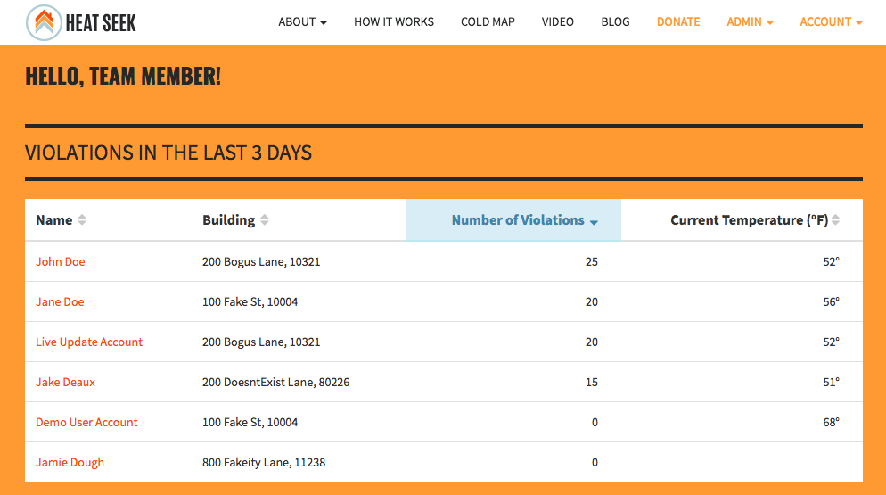

[](https://codeship.com/projects/20839)
[](https://codeclimate.com/github/heatseeknyc/heatseeknyc)
[](https://coveralls.io/r/wfjeff/twinenyc)

# Heat Seek NYC

## Description

We’re a team of New Yorkers who believes no New Yorker should have to spend the winter in a frigid apartment. The reality is, this happens to thousands of us every year, creating a public health hazard and some serious animosity between tenants and landlords.

At Heat Seek NYC, we’re using temperature sensors to empower tenants, landlords, community organizations, and the justice system to tackle our city’s heating crisis. We:

* Provide unbiased evidence to verify heating code abuse claims in housing court
* Help landlords heat their buildings more effectively while reducing costs
* Create transparency in heating data to educate the community and inform housing policy
* Our affordable temperature sensors can be installed in any number of apartments per building. They talk to each other via mesh network to periodically collect and transmit ambient temperature data to Heat Seek NYC’s servers. Our powerful web app integrates this data with public 311 heating complaint information to deliver a better picture of New York City’s heating crisis than ever before.

We are working closely with community organizations, landlords, and the HPD to make our technology available to thousands of New Yorkers in time for the cold.

## The Process

Heat Seek staff and volunteers install the temperature sensors at the beginning of heat season (Oct 1 - May 31), and they remain in place throughout the winter. The temperature sensors monitor the temperature by taking a reading once per hour. Readings are transmitted via 3G internet to our web app, where they are recorded in the tenant’s account. The web app incorporates the outdoor temperature, the time of day, and time of year in order to identify whether or not a building is in violation of NYC housing code. Tenants and their advocates can access our web app at any time to view their readings and can download heat logs for use in tenant-landlord negotiations and/or housing court.

## Screenshots






## Development/Contribution

If you'd like to contribute to the code base, please submit a pull request. See our [Contribution Guide](CONTRIBUTING.md).

## Development Environment Setup

Be sure you have Postgres installed and running on your machine, then run these commands from the project's root directory:

```bash
bundle install
createuser -s -r twinedb_development_user
rake db:create
rake db:migrate
rake db:seed
```

You can login as a Super User to view admin pages:

```
email: super-user@heatseeknyc.com
password: 33west26
```

or you can login as Jane Doe for the more limited tenant experience:

```
email: jane@heatseeknyc.com
password: 33west26
```

## Rake Tasks

There are a couple rake tasks that require API tokens.

The data scrubber task requires a Google Geocode API token, which can be generated [here](https://developers.google.com/maps/documentation/geocoding/get-api-key).
It also requires a Geoclient App id and token, which can be generated [here](https://developer.cityofnewyork.us/api/geoclient-api).

```
rake data:scrub_data
```

The weather update task requires a Wunderground API token, which can be generated [here](https://www.wunderground.com/weather/api).

```
rake weather:update
```

This project uses the [Dotenv](https://github.com/bkeepers/dotenv) gem to store environment variables so add a `.env.development.local` file to the root of this project with the following:

```
GEOCODE_API_KEY=<token>
WUNDERGROUND_KEY=<token>
GEOCLIENT_APP_ID=<token>
GEOCLIENT_APP_KEY=<token>
```

## License

This application is MIT Licensed. See [LICENSE](LICENSE.txt) for details.
